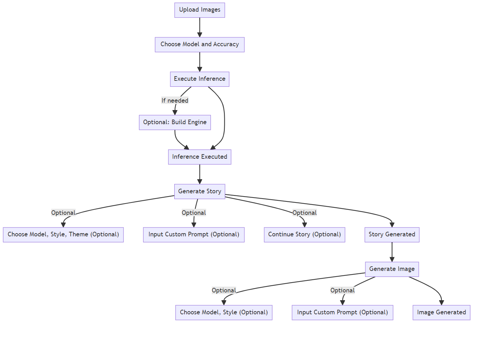
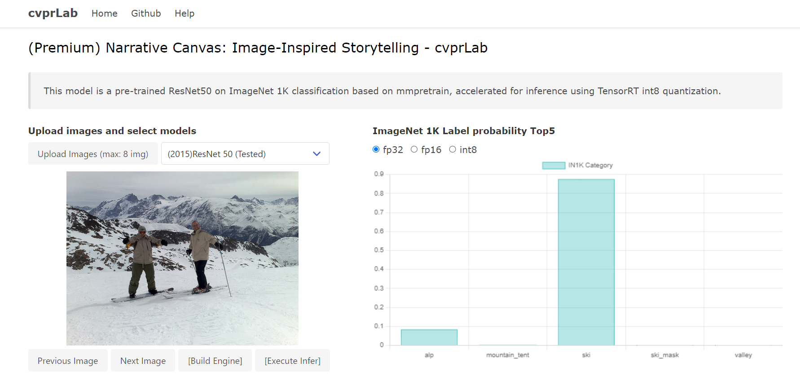
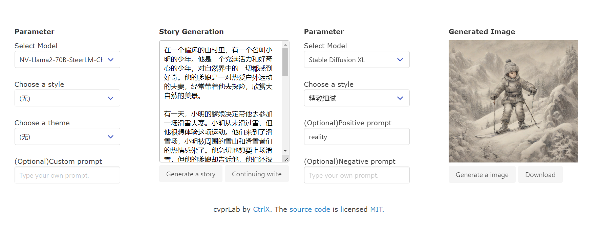
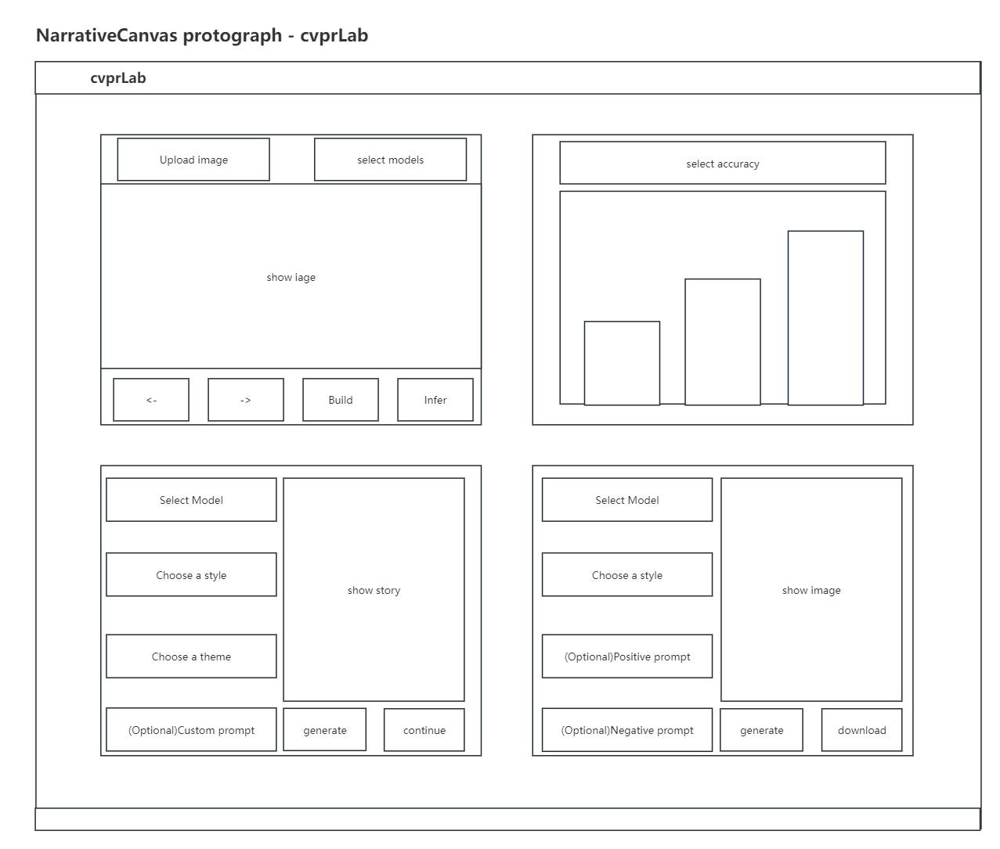
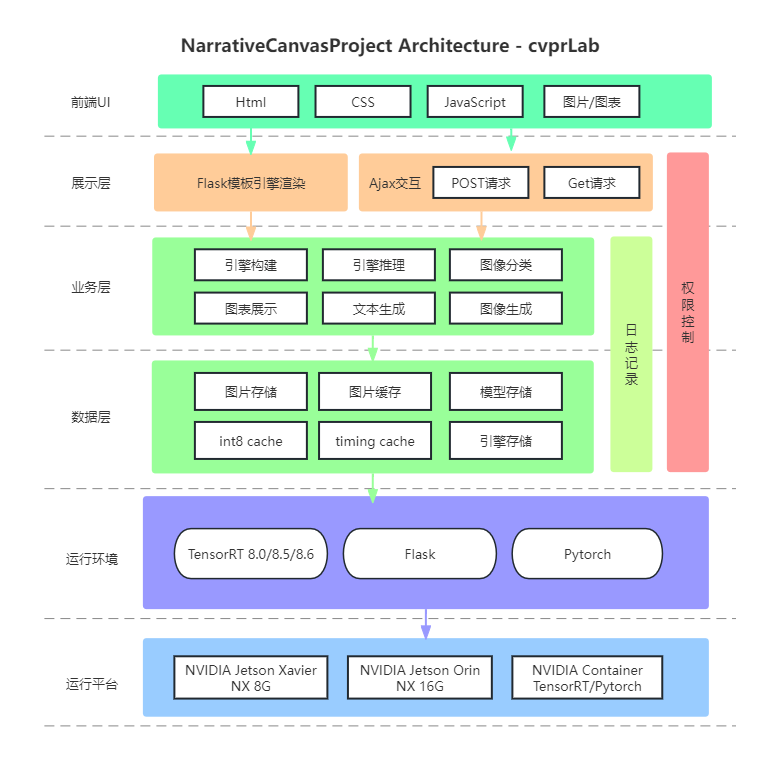
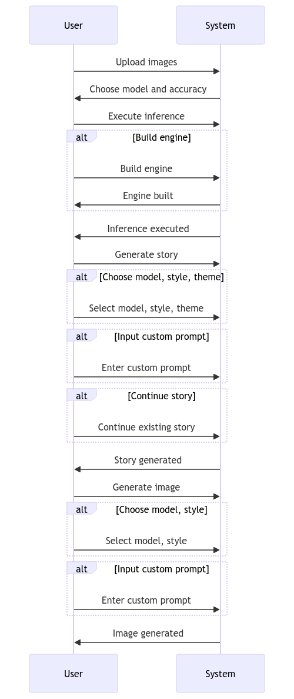

# Narrative Canvas: Image-Inspired Storytelling

Narrative Canvas, also known as "Language Within the Paintings," is the very essence of this project. Here, each canvas is not merely a combination of colors and lines but a collection of untold stories waiting to be discovered. Artists unleash their imaginations onto the canvas, and every stroke and every brushstroke carries profound emotions and a unique perspective. These artworks, akin to poems without words, quietly narrate their own tales.

This project has successfully implemented image inference tasks, text generation tasks, and image generation tasks on the Jetson development board. It utilizes TensorRT for accelerated inference and Flask to run the UI page. This project was awarded first place in the Nvidia 9th Sky Hackathon competition.

## Demonstration

Video Demonstration Link: https://www.bilibili.com/video/BV1rc411D7pP

The entire project workflow can be divided into the following steps:

1. Image Inference
2. Story Generation
3. Image Generation



## Prerequisites

### Prepare Model && Calibration Data

#### ONNX

Our project models are based on the mmpretrain pre-trained models from the mmlab algorithm library. We have carefully selected 25 classic backbone networks for the image classification task in this project. We also provide scripts for converting PyTorch (pt) models to ONNX models, including the recent work on EfficientVit. Additionally, we offer conversion scripts to export ONNX models in Dynamic Shape mode. 

We provide both preprocessed ONNX models using Polygraphy and the original exported ONNX model files, You can choose to download it from [Google Drive](https://drive.google.com/file/d/1T0-ZIWmZ7eQ7y6KvjXEUbsswfG1GvcNe/view?usp=drive_link) or [Hugging Face](https://huggingface.co/CtrlX/ModelReady-pretrain/tree/main).

Please place the downloaded ONNX file into the `models/onnx` directory.

#### Calibdata

Our calibration dataset consists of 510 images selected from the ImageNet 1K validation dataset. We also provide a [download link](https://drive.google.com/file/d/10QTdYG3SvPnC8xLRYmjBFWInl0qEgbza/view?usp=drive_link) for the calibration dataset. 

Please place the downloaded calibdata file into the `models/calibdata` directory.

### Prepare API

Before running this project, you need to prepare the [Nvidia NGC llama2-70b-steerlm API](https://catalog.ngc.nvidia.com/orgs/nvidia/teams/ai-foundation/models/llama2-70b-steerlm/api) and the [Nvidia NGC Stable Diffusion XL API](https://catalog.ngc.nvidia.com/orgs/nvidia/teams/ai-foundation/models/sdxl/api) and fill in their details in the `config.json` file. You can also fill in your Azure OpenAI API key in the config.json if you have one, but this is not mandatory.

```json
"sdxl": {
    "invoke_url": "" ,
    "fetch_url_format": "",
    "headers": {
        "Authorization": "",
        "Accept": ""
    }
},
"llama2": {
    "invoke_url": "",
    "fetch_url_format": "",
    "headers": {
        "Authorization": "",
        "Accept": ""
    }
},
"azure_openai":{
    "api_key": "",
    "api_base": "",
    "deployment_name": "",
    "api_version": ""
}
```

### Setup Runtime Environment

We provide two methods for building the runtime environment for different hardware environments. One is deploying the environment using Nvidia Container on Windows or Linux, and the other is configuring the environment using pip on a Jetson Orin development board.

- Nvidia Container
  - [Pytorch 23.10](https://catalog.ngc.nvidia.com/orgs/nvidia/containers/pytorch) (Ubuntu 22.04 + TensorRT 8.6.1.6 + CUDA 12.2.1)

- Nvidia Jetson Orin
  - [Jetpack 5.1.2](https://developer.nvidia.com/embedded/jetpack) (Jetson Linux 35.4.1 + TensorRT 8.5.2 + DLA 3.12.1 + cuDNN 8.6.0 + CUDA 11.4.19)

> Note: If you are using the **Jetson Xavier NX** hardware platform, please refer to this project: https://github.com/1438802682/NarrativeCanvas-JetsonXavierNX

#### Windows && Linux

We provide a [Dockerfile](./docker/Dockerfile) to ease environment setup. Please execute the following command to build the docker image after nvidia-docker installation:

```
docker build -t sky docker
```

#### Jetson Orin

Before building the runtime environment on the Jetson Orin platform, please upgrade the Jetson Orin's JetPack environment version to 5.1.2, and then execute the following command:

```
pip3 install requirements.txt
```

## Run

We can then run the docker with the following command:

### Windows && Linux

- Windows:

```bash
docker run --gpus all --rm -it -p 3008:3008 -v %cd%:/sky sky
```
> Note:  When you start the sky container with the default command mentioned above, it automatically executes the following command: `gunicorn -b 0.0.0.0:3008 app:app`. Alternatively, you can also use the following command to start the container using Flask's default command. Using Gunicorn to deploy our application can achieve higher performance.

```
docker run --gpus all --rm -it -p 3008:3008 -v %cd%:/sky sky flask run --host=0.0.0.0 --port=3008
```

- Linux:

```bash
docker run --gpus all --rm -it -p 3008:3008 -v $PWD:/sky sky
```

After you have completed the steps above, please visit http://127.0.0.1:3008/ to embark on your creative journey!

### Jetson Orin

```py
gunicorn -b 127.0.0.1:3008 app:app
```

After you have completed the steps above, please visit http://127.0.0.1:3008/ to embark on your creative journey!

## Note

### Demonstration Sample





### UI Prototype



### Project Architecture Diagram



### Flowchart




- If you encounter any issues or would like to obtain more technical details, please feel free to contact me at [1438802682@qq.com](mailto:1438802682@qq.com)

## References

- [Narrative Canvas on Jetson Xavier NX](https://github.com/1438802682/NarrativeCanvas-JetsonXavierNX)
- [EfficientViT: Multi-Scale Linear Attention for High-Resolution Dense Prediction](https://github.com/mit-han-lab/efficientvit)
- [MMPreTrain is an open source pre-training toolbox based on PyTorch](https://github.com/open-mmlab/mmpretrain/tree/main/mmpretrain)

